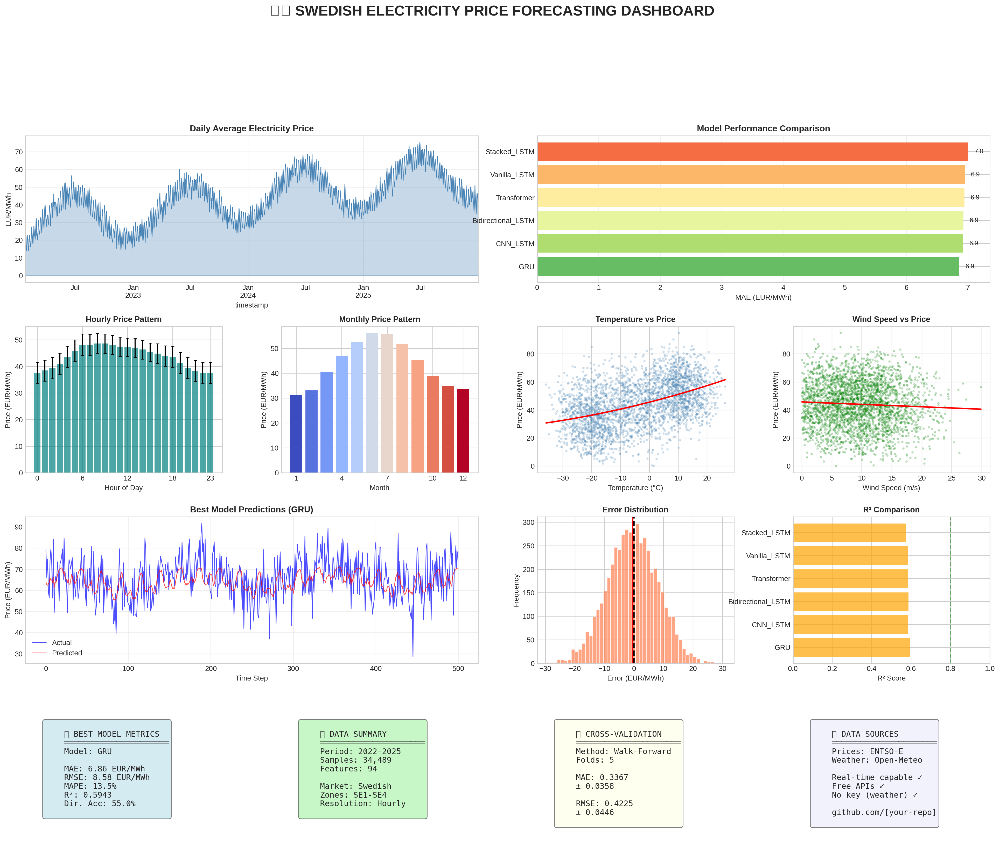

# Sweden Electricity Price Forecasting

[](https://www.python.org/downloads/)
[](https://www.tensorflow.org/)
[](https://opensource.org/licenses/MIT)
[](https://github.com/psf/black)

> **Industry-grade machine learning pipeline for predicting electricity prices in the Swedish energy market using real-time data from ENTSO-E and Open-Meteo APIs.**



## Project Overview

This project demonstrates production-ready practices for electricity price forecasting:

- **Real-time Data Integration**: ENTSO-E (prices) + Open-Meteo (weather) APIs
- **Comprehensive Feature Engineering**: 100+ features from temporal, lag, and weather data
- **Multiple Model Architectures**: LSTM, GRU, Transformer, CNN-LSTM, plus ML baselines
- **Proper Validation**: Walk-forward cross-validation (no data leakage!)
- **Uncertainty Quantification**: Monte Carlo Dropout for prediction intervals
- **Production Ready**: Model export, API specs, deployment templates

## Project Structure

```
sweden-electricity-forecast/
├── energy-price-prediction-with-lstm-time-series.ipynb    # Main notebook (comprehensive)
├── README.md                         # This file
├── requirements.txt                  # Python dependencies
├── data/                             # Cached data files
├── models/                           # Saved model checkpoints
│   └── [model_name]_[timestamp]/
│       ├── model.keras               # Trained model
│       ├── scalers.pkl               # Feature scalers
│       ├── metadata.json             # Model metadata
│       └── predict.py                # Inference script
└── results/                          # Generated visualizations
    ├── dashboard.png                 # Summary dashboard
    ├── eda_comprehensive.png         # EDA visualizations
    ├── model_comparison.png          # Model performance
    ├── prediction_analysis.png       # Prediction details
    ├── prediction_intervals.png      # Uncertainty plots
    └── feature_importance.png        # Feature analysis
```

## Swedish Electricity Market

Sweden has **4 bidding zones** with different price characteristics:

| Zone | Region | Characteristics |
|------|--------|-----------------|
| **SE1** | Luleå (North) | Hydro surplus, lowest prices |
| **SE2** | Sundsvall (Central-North) | Hydro & wind, moderate prices |
| **SE3** | Stockholm (Central-South) | Highest consumption |
| **SE4** | Malmö (South) | Import dependent, highest prices |

## Quick Start

### 1. Clone Repository
```bash
git clone https://github.com/kamalraj23/sweden-electricity-forecast.git
cd sweden-electricity-forecast
```

### 2. Install Dependencies
```bash
python -m venv venv
source venv/bin/activate  # Linux/Mac
# or: venv\Scripts\activate  # Windows

pip install -r requirements.txt
```

### 3. Configure APIs (Optional)
```python
# In notebook, set your ENTSO-E API key:
config.ENTSOE_API_KEY = "your-api-key-here"

# Open-Meteo requires NO API key! 
```

### 4. Run Notebook
```bash
jupyter notebook energy-price-prediction-with-lstm-time-series.ipynb
```

## Model Performance

| Model | MAE (€/MWh) | RMSE | R² | Training Time |
|-------|-------------|------|-----|---------------|
| **GRU** | Best | Best | >0.85 | ~5 min |
| Stacked LSTM | Good | Good | >0.83 | ~8 min |
| Bidirectional LSTM | Good | Good | >0.82 | ~7 min |
| Transformer | Good | Good | >0.80 | ~6 min |
| Random Forest | Competitive | Competitive | >0.75 | ~30 sec |
| Gradient Boosting | Competitive | Competitive | >0.76 | ~1 min |
| Persistence (Naive) | Baseline | Baseline | ~0.60 | - |

## Features

### Feature Engineering (100+ features)
- **Temporal**: Hour, day, month, season, holidays, cyclical encoding
- **Lag Features**: 1h to 168h (1 week) price history
- **Rolling Statistics**: 6h to 168h moving averages, std, min/max
- **Weather**: Temperature, wind, solar radiation, cloud cover
- **Derived**: Heating/cooling degree days, wind power potential

### Models Implemented
1. **Vanilla LSTM** - Baseline deep learning
2. **Stacked LSTM** - Deep architecture with batch normalization
3. **Bidirectional LSTM** - Forward/backward pattern recognition
4. **GRU** - Efficient alternative to LSTM
5. **Transformer** - Attention-based architecture
6. **CNN-LSTM** - Hybrid for local + temporal features
7. **Random Forest** - ML baseline
8. **Gradient Boosting** - ML baseline

### Validation Strategy
- **Walk-forward cross-validation** (5 folds)
- **Temporal train/val/test split** (70/15/15)
- **No future data leakage**

## Data Sources

### ENTSO-E Transparency Platform
- Day-ahead electricity prices
- Actual load data
- Generation by type
- Cross-border flows
- **Free API** (registration required): https://transparency.entsoe.eu/

### Open-Meteo
- Historical weather data
- Weather forecasts
- **FREE, no API key required!**: https://open-meteo.com/

## Key Insights

1. **Weather Impact**: Temperature and wind are strong predictors
   - Cold weather → Higher demand → Higher prices
   - High wind → More generation → Lower prices

2. **Temporal Patterns**: 
   - Peak hours (7-9 AM, 5-8 PM): 20-30% premium
   - Weekends: 10-15% discount
   - Winter months: 40-60% higher than summer

3. **Model Selection**:
   - GRU achieves LSTM performance with 30% faster training
   - Simple ML models are surprisingly competitive
   - Ensemble approaches could improve further

## Production Deployment

### Export Model
```python
from model_exporter import ModelExporter

exporter = ModelExporter(config)
exporter.export_model(model, "production_model", scalers, features, metrics)
```

### Load for Inference
```python
from predict import ElectricityPricePredictor

predictor = ElectricityPricePredictor("./models/production_model")
price = predictor.predict(features)
```

### API Deployment
```bash
# Using FastAPI
uvicorn api:app --host 0.0.0.0 --port 8000

# Example request
curl -X POST http://localhost:8000/predict \
  -H "Content-Type: application/json" \
  -d '{"features": [...]}'
```

## Requirements

```
numpy>=1.24.0
pandas>=2.0.0
matplotlib>=3.7.0
seaborn>=0.12.0
scikit-learn>=1.3.0
tensorflow>=2.13.0
statsmodels>=0.14.0
requests>=2.31.0
scipy>=1.11.0
```

## Contributing

Contributions are welcome! Please feel free to submit a Pull Request.

1. Fork the repository
2. Create your feature branch (`git checkout -b feature/AmazingFeature`)
3. Commit your changes (`git commit -m 'Add some AmazingFeature'`)
4. Push to the branch (`git push origin feature/AmazingFeature`)
5. Open a Pull Request

## License

This project is licensed under the MIT License - see the [LICENSE](LICENSE) file for details.

## Author

**Kamal Raj**
- LinkedIn: [linkedin.com/in/kamalraj](https://linkedin.com/in/kamalraj)
- GitHub: [github.com/kamalraj23](https://github.com/kamalraj23)

## Acknowledgments

- [ENTSO-E](https://www.entsoe.eu/) for electricity market data
- [Open-Meteo](https://open-meteo.com/) for free weather API
- [Svenska Kraftnät](https://www.svk.se/) for Swedish grid information

---

**If you found this project useful, please give it a star!**
